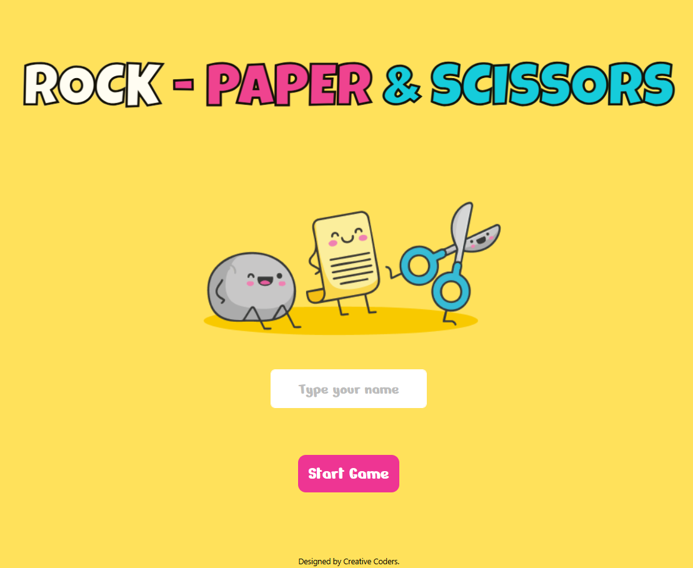

# Rock Paper Scissors Game

## Description

This is a simple yet interactive Rock Paper Scissors game implemented in JavaScript. The game allows the player to compete against the computer, with animations and score tracking. The first to reach the maximum score wins.

## Features

- Player name input via URL parameters
- Animated gameplay experience
- Score tracking for both the player and the computer
- A winning and losing modal display
- Ability to restart the game

## How to Play

1. Open the game in a browser.
2. Enter your name when prompted.
3. Click on either Rock, Paper, or Scissors to make your choice.
4. The computer will randomly select its choice.
5. The winner of the round is determined based on traditional Rock Paper Scissors rules:
   - Rock beats Scissors
   - Scissors beats Paper
   - Paper beats Rock
6. The first to reach 3 points wins the game.

## Game Mechanics

- Buttons are temporarily disabled while the game plays an animation.
- A result message is displayed after each round.
- When either the player or the computer reaches the maximum score, a modal announces the winner.
- Players can restart the game at any time.

## Technologies Used

- HTML
- CSS
- JavaScript
- Bootstrap

## Setup Instructions

1. Clone the repository: https://github.com/DennisMiranda/rock-paper-scissors-game.git
2. Open `index.html` in a web browser.
3. Enjoy the game!

## Future Improvements

- Add more animations and sound effects.
- Implement different difficulty levels.
- Improve the user interface for a better experience.
